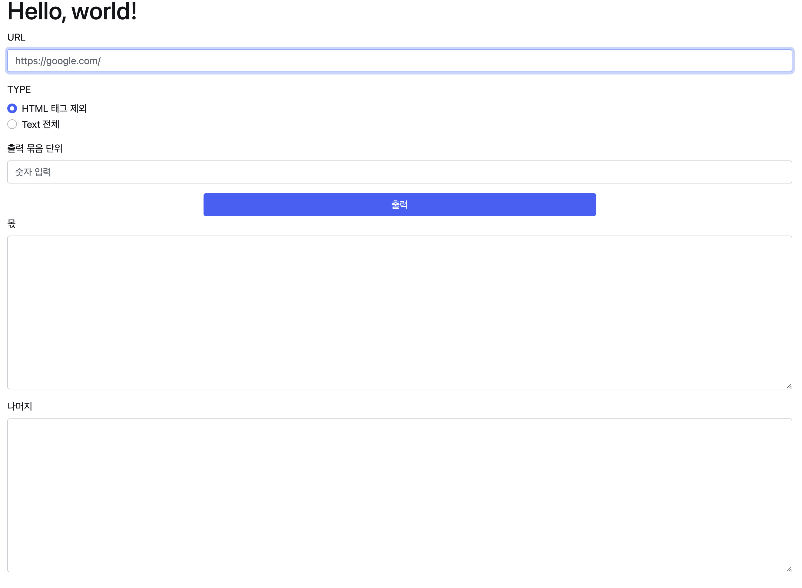

# Wemakeprice-Test

## HTML Filter 프로세스

## 문제정의
1. URL를 통해 HTML을 읽어 온다.
2. HTML 태그는 옵션을 통해 제거한다. 
   * 선택하지 않으면 전체 Text를 읽는다. 
3. 영어, 숫자만 추출한다. 
4. 오름차순으로 정렬한다. 
    * 영어: AaBbCc...YyZz
    * 숫자: 01234
   
5. 영어와 숫자를 한글자씩 교차하여 섞는다.
   * 영어, 숫자, 영어, 숫자 예) a1b2c3
   
6. 입력받은 출력 묶음으로 몫, 나머지로 나누어 출력한다. 

